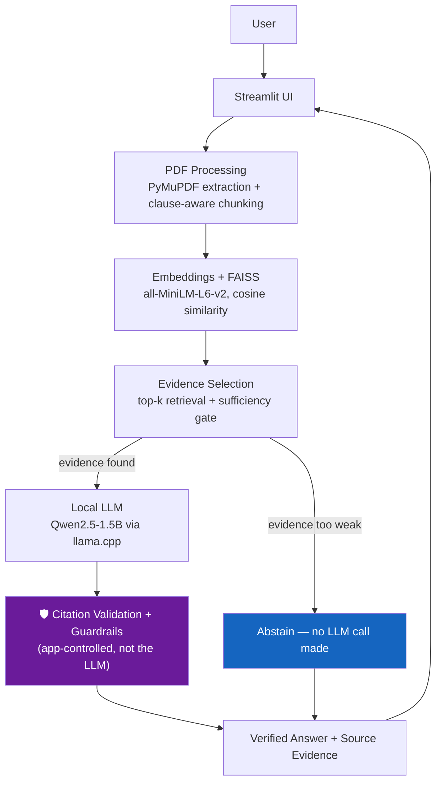

# PolicyLens AI — Evidence-Grounded Insurance Policy Explainer

A local, private, retrieval-augmented AI application that answers plain-English questions about an uploaded insurance policy PDF — and never answers unless it can point to the exact clause and page it came from.

> **This is an educational document-explanation tool, not insurance advice.** It does not make coverage decisions. Your insurance policy document and your insurer's official interpretation and decision always govern.

---

## The Problem

Insurance policy documents are long, dense, and written in language most people don't use day to day. A customer trying to answer a simple question — *"Is dental treatment covered?"*, *"What's the waiting period for a pre-existing condition?"*, *"What's excluded?"* — usually has to read a 30-50 page PDF themselves, or call the insurer and wait. The cost of getting it wrong is real: a customer who wrongly assumes something is covered can face a denied claim; one who wrongly assumes something is excluded may not claim something they were entitled to.

A generic chatbot "helpfully" answering from general insurance knowledge makes this *worse*, not better — it will sound confident regardless of whether it actually read your specific policy.

## The Solution

This application uses retrieval-augmented generation (RAG) constrained by one non-negotiable rule:

> ## NO EVIDENCE → NO ANSWER
>
> The uploaded policy document is the only source of truth. If the system can't point to a specific clause that supports an answer, it says so — it does not guess, and it does not fall back on general insurance knowledge.

Every answer a user sees has already passed through an application-controlled trust layer that the LLM cannot override: the LLM never gets to invent a page number, a clause number, or a citation. It only ever picks from evidence the application already retrieved and verified.

## Key Features

All of the following are implemented and tested — not aspirational:

- **Policy-grounded answers** — every substantive answer (`Covered` / `Explicitly Excluded`) requires a citation; the LLM cannot skip this.
- **Evidence-based citations** — Section → Clause → Page, resolved entirely from application metadata, never from LLM output.
- **Safe abstention** — `Not Mentioned` / `Insufficient Evidence` / `No Evidence Found` are first-class outcomes, not failures. Silence in the policy is never presented as an exclusion.
- **Citation validation** — a cited `evidence_id` must exist, belong to the evidence actually shown to the model, and belong to the active policy; a direct quote is verified against the source text (exact → normalized match) before being labeled as one.
- **Guardrails that cross-check the LLM against independent metadata** — e.g. a `Covered` claim citing a clause from an Exclusions section gets automatically downgraded, using clause-structure metadata computed back in the PDF-parsing stage, which the LLM never sees.
- **PDF evidence highlighting** — click "View Evidence in Policy" and see the actual PDF page with the supporting sentence highlighted, or an honest "couldn't auto-highlight" fallback — never a fabricated highlight.
- **100% local / private processing** — PDF parsing, embeddings, vector search, and the LLM all run on your machine. No document content is ever sent to a third-party API.
- **End-to-end evaluation with a dashboard** — a hand-verified 41-question golden dataset run through the real pipeline (not a mock), with results tracked run-over-run for regression testing.

## Architecture



**The LLM is deliberately not the source of truth anywhere in this diagram.** It receives short, labeled evidence excerpts (`[E1]`, `[E2]`, `[E3]` — no page/clause numbers in the prompt at all) and picks a label; every citation shown to the user is rebuilt from the application's own stored metadata for that label, never from anything the model wrote.

## Trust & Safety Architecture

### Grounded generation
The LLM only ever sees the top 3 retrieved clauses for a question (~300 tokens on average) — never the full policy, never prior conversation history. It is explicitly instructed not to use outside insurance knowledge.

### No evidence, no answer
Before the LLM is even called, a Python-level relevance check on the retrieval score can reject the question outright (an honest *"I couldn't find this clearly addressed in the uploaded policy"* — zero LLM tokens spent). This threshold (0.30) is a deliberately low floor, chosen from measured score distributions in Phase 5's evaluation, not a guess — see `app/config.py` for the reasoning.

### Application-controlled citations
The LLM selects a short label (`E1`/`E2`/`E3`); the application resolves that label back to the real, stored clause/page/section. There is no code path by which the LLM's own text can become a displayed clause number or page number.

### Citation validation
- An `evidence_id` must exist, belong to the evidence actually supplied for that question, and belong to the active policy document.
- A claimed direct quote is checked against the source text (exact match → whitespace/punctuation-normalized match); if neither succeeds, the UI shows a verified excerpt taken directly from the stored clause instead — never an unverified "quote."
- Numbers in the answer (waiting periods, day counts) that don't appear anywhere in the cited evidence get flagged and the answer is downgraded to a safe fallback.

### Guardrails
A `Covered`/`Explicitly Excluded` status is cross-checked against clause-level metadata computed independently during PDF processing (`is_exclusion_section`, `contains_exclusion_language`) — signals the LLM never sees. A mismatch (e.g. `Covered` citing a clause from the Exclusions section) is automatically downgraded to `Insufficient Evidence` rather than shown as-is.

### Honest limitations
**These guardrails reduce, but do not eliminate, wrong answers.** The measured evaluation below found a 7.3% Wrong-but-Confident rate — cases where the system presented a wrong status as if verified. The keyword/metadata heuristics behind the guardrails can miss an exclusion phrased unusually, and a small local LLM can still misjudge a clause that mixes a general rule with a specific exception in one sentence (its most common real failure pattern — see Evaluation below). This system does not claim to have solved hallucination; it claims to have built a pipeline that measures it, catches a meaningful share of it, and fails toward caution rather than confidence when it doesn't.

## Evaluation

Methodology and full results: [`docs/evaluation.md`](docs/evaluation.md). Summary:

A 41-question golden dataset (hand-verified against the actual test policy, not LLM-generated) covering coverage, exclusions, waiting periods, eligibility, ambiguous/broad questions, unsupported topics, and conflict/exception cases was run through the **real, complete pipeline** — real retrieval, real local LLM calls, real guardrails.

| Metric | Result |
|---|---|
| Answer Accuracy | 36.6% |
| Status Accuracy | 56.1% |
| Citation Accuracy | 73.3% |
| Retrieval Success Rate | 100% |
| Appropriate Abstention Rate | 85.7% |
| **Wrong-but-Confident Rate** | **7.3%** |
| Avg. response time | 3.3s |

**What this actually means:** retrieval is not the bottleneck (100% success) — the dominant failure mode (24% of questions) is the local LLM being *too cautious*, hedging into "Insufficient Evidence" on questions with clear evidence available. Given this product's core safety principle, that is the safer failure direction. The more serious 7.3% Wrong-but-Confident rate is concentrated in one specific, well-understood pattern: clauses that mix a general rule with an accident/exception carve-out in one sentence (e.g. *"excluded unless required to treat an accidental injury"*) — the guardrail's current exclusion-metadata flags can't yet distinguish "this clause is purely an exclusion" from "this clause has a conditional exception," so a wrong conclusion sourced from such a clause isn't always caught. That is the top-priority item in Future Improvements below.

**This project does not claim production readiness.** A 36.6% raw answer-accuracy rate and a >5% Wrong-but-Confident rate on a 41-question dataset are not production-grade numbers, and are reported as such.

## Quick Start (Windows)

Requires Python 3.11+ and ~2GB free disk space (mostly the model). No paid API, no cloud account, no GPU required.

```powershell
git clone <this-repo>
cd insurance-policy-explainer

setup.bat            REM one-time: creates venv, installs dependencies
download_model.bat   REM one-time: downloads the local LLM (~1GB, from Hugging Face)
run_app.bat          REM starts the LLM server + the Streamlit app
```

Then open **http://localhost:8501**, upload `data/policies/sample_health_policy.pdf` (included — see [Sample Data](#sample-data)) or your own policy PDF, and ask a question.

If you'd rather run each step yourself (or you're not on Windows), see [`docs/setup_manual.md`](docs/setup_manual.md) for the exact commands each `.bat` file wraps.

## Running Tests and Evaluation

This project uses standalone, narrated verification scripts (one per phase of development) rather than pytest — each script explains what it's checking and why as it runs, which matters more here than a green checkmark, since the whole point of this project is *why* an answer can be trusted.

```powershell
run_tests.bat          REM runs every verification script in build order
run_evaluation.bat      REM runs the 41-question golden-dataset evaluation (needs the LLM server running)
run_dashboard.bat       REM launches the analytics dashboard on :8502
```

See [`docs/testing.md`](docs/testing.md) for what each test script actually covers and why those components were prioritized.

## Sample Data

`data/policies/sample_health_policy.pdf` is a **synthetic** policy document written for this project — not a real insurer's document, safe to redistribute, safe to test with. It includes definitions, coverage clauses, waiting periods, and exclusions modeled on real policy structure.

Try asking:
- *"Is dental treatment covered?"*
- *"What is the waiting period for pre-existing conditions?"*
- *"What happens if I make a claim during the first year?"*
- *"Does this policy cover space travel?"* (an intentionally unsupported question — watch it abstain safely)

You can also upload your own real policy PDF — nothing leaves your machine.

## Screenshots

See [`docs/screenshots/`](docs/screenshots/) for the upload flow, a verified answer with citation, the evidence-highlighting view, a safe abstention, and the analytics dashboard.

## Project Structure

```
insurance-policy-explainer/
├── app/
│   ├── pdf_processing/   # extraction, clause-aware chunking, PDF highlighting
│   ├── rag/              # embeddings, FAISS, retrieval, answer generation
│   ├── llm/               # local LLM HTTP client (llama.cpp server)
│   ├── validation/        # citation validation, guardrails, claim checking
│   ├── evaluation/        # golden datasets, evaluator, metrics, reports
│   ├── analytics/         # analytics dashboard (separate Streamlit app)
│   ├── database/          # SQLite: user feedback, evidence-view events
│   ├── storage/           # JSONL validation/audit log
│   ├── ui/                 # Streamlit components (presentation only)
│   └── config.py           # centralized, .env-overridable configuration
├── tests/                  # one narrated verification script per phase
├── data/
│   ├── policies/            # uploaded PDFs (sample_health_policy.pdf is committed)
│   ├── indexes/             # FAISS indexes (regenerated automatically)
│   ├── evaluation/           # golden-dataset run results (data, kept)
│   └── logs/                  # JSONL audit trail (regenerated automatically)
├── models/                    # local GGUF model (downloaded, not committed)
├── docs/                       # architecture/eval/testing notes, case study, screenshots
├── app.py                      # Streamlit entry point
├── requirements.txt
├── .env.example
└── .gitignore
```

*(Deviation from a generic template, noted for transparency: there's no separate top-level `evaluation/` folder — the golden datasets live in `app/evaluation/` next to the code that consumes them, and run results live in `data/evaluation/`, consistent with how the rest of the project separates code from data.)*

## Limitations

- Tested against one synthetic sample policy and a 41-question dataset — not yet validated against a large, diverse set of real-world policy documents and formats.
- The 1.5B local LLM is the main accuracy ceiling; a larger model (3B+) would likely reduce both the "too cautious" and "wrong-but-confident" rates, at the cost of slower responses on modest hardware.
- Guardrail metadata (exclusion detection) is keyword/structure-based, not a semantic understanding of legal language — it can miss an exclusion phrased unusually.
- Evidence highlighting depends on PyMuPDF's text search; it correctly falls back to "couldn't highlight, here's the verified text" rather than faking a match, but can't highlight a clause whose exact wording doesn't literally appear on the PDF page (e.g. from encoding artifacts in unusual PDFs).
- Single-user, single-machine design — no authentication, no multi-user document isolation, no production-grade scaling.

## Roadmap (not implemented — see [`docs/case_study.md`](docs/case_study.md) for reasoning)

**V2:** multi-policy comparison, policy version tracking, better conflict/exception detection (the top item from Evaluation above).
**V3:** a larger evaluation dataset across multiple real policies, a human-review workflow for flagged answers, multilingual support.
**A real production version** would additionally need: authentication and per-user document isolation, encrypted document storage, monitoring/alerting on the safety metrics measured here, a scalable vector database, and professional legal/compliance review — none of which are portfolio-appropriate to build without an actual insurer as a partner.

## License / Disclaimer

Educational/portfolio project. Not affiliated with any insurer. Not insurance advice. See the in-app disclaimer shown with every answer.
